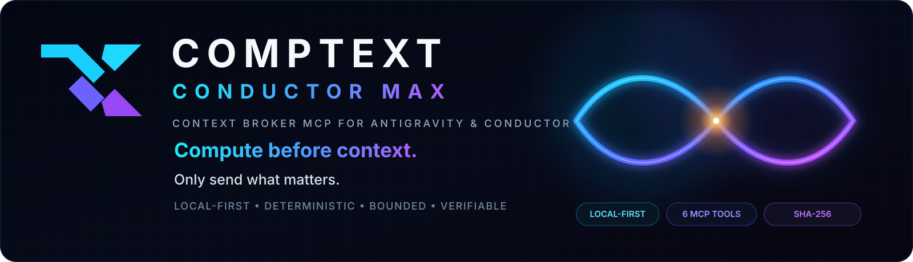
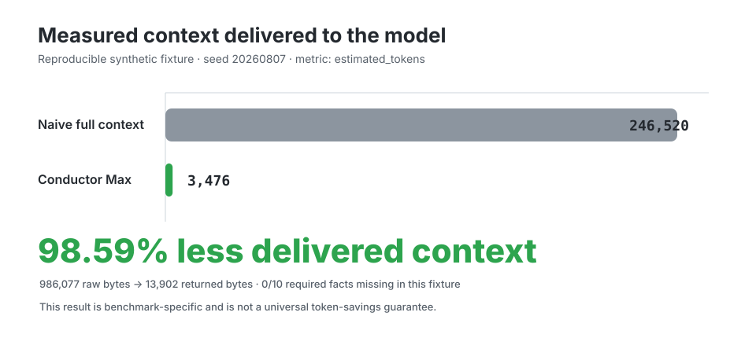
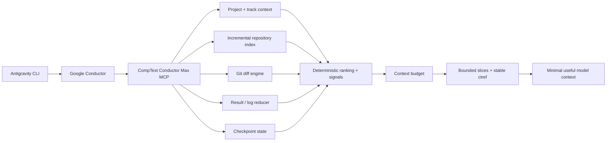
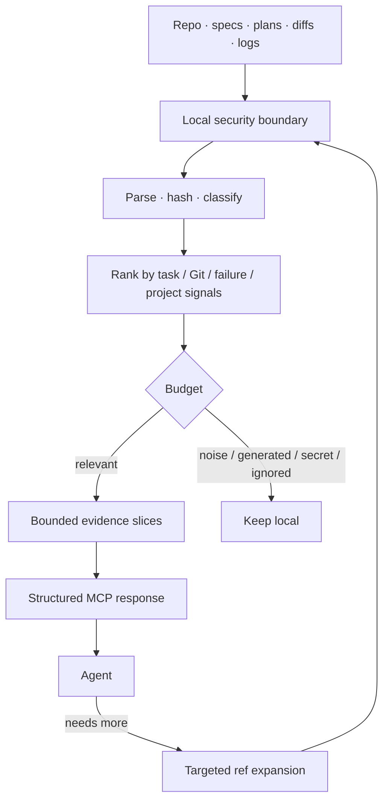
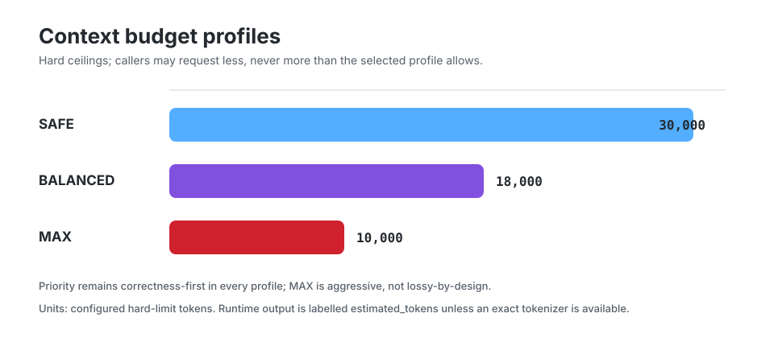
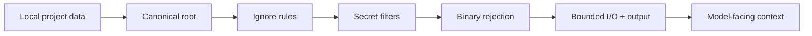
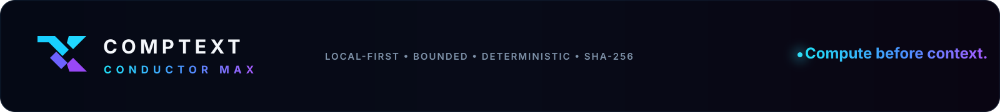

<p align="center">
  
</p>

<p align="center">
  
  
  
  
  
  
  
</p>

<p align="center">
  <strong>Compute before context.</strong><br/>
  A local-first Context Broker MCP for Google Conductor + Antigravity that turns repositories, specs, diffs and logs into the smallest useful context for the next agent step.
</p>

<p align="center">
  <a href="#problem">Why</a> ·
  <a href="#verified-main-state">Evidence</a> ·
  <a href="#architecture">Architecture</a> ·
  <a href="#benchmark-snapshot">Benchmark</a> ·
  <a href="#mcp-tool-matrix">MCP tools</a> ·
  <a href="#security">Security</a> ·
  <a href="#installation">Install</a>
</p>

---

## Verified main state

**v0.2.0 is now landed on `main`.** The landing includes the post-review security/correctness repair tranche and completed green on GitHub Actions **Run #99** at merge commit `ae8567e1fa7f949e96e8a7db8e44ec60c7ec8ad9`.

| Invariant | Current state |
| --- | --- |
| Primary MCP tools | **Exactly 6** |
| Generic shell / passthrough | **Not exposed** |
| Default runtime | **Local-first / stdio** |
| Conductor integration | **Read-only / unforked** |
| Context references | **Content-bound `ctref:v1:*`** |
| Large indexed files | **Explicitly report `truncated_paths`** |
| Git diff default | **Includes staged + unstaged tracked changes** |
| Result fallback | **Never re-exposes secret-filtered lines** |
| Main quality gate | **Green** |

> Benchmark figures in this README are reproducible synthetic-fixture measurements, not universal savings guarantees. Real Antigravity host-token savings require equivalent authenticated A/B workloads and are not claimed here.

## Problem

Agentic coding systems are often forced to spend expensive model context on work that is deterministic and local:

- reading entire repositories to find a few relevant functions;
- replaying full specs and plans instead of the current step;
- shipping complete Git diffs when one hunk is enough;
- sending thousands of test/build log lines to discover one failure;
- re-reading unchanged files across turns;
- carrying old conversation history instead of a compact checkpoint.

**CompText Conductor Max moves that work outside the model.** It indexes, hashes, ranks, classifies, reduces and budgets locally, then returns bounded evidence for the current task.

The design goal is not “shorter prose.” It is **less irrelevant information entering model context in the first place**.

## Benchmark snapshot

<p align="center">
  
</p>

Reproducible v0.2 synthetic fixture, seed `20260807`:

| Metric | Naive full context | Conductor Max BALANCED | Result |
| --- | ---: | ---: | ---: |
| Raw / returned bytes | 986,077 | 13,902 | **-972,175** |
| `estimated_tokens` | 246,520 | 3,476 | **-243,044** |
| Delivered-context reduction | — | — | **98.59%** |
| Required fixture facts missing | 0 / 10 | 0 / 10 | **no loss in fixture** |

Fixture SHA-256:

```text
60e3a95992e3dd4786f8e858991bf8ca3cedff8831ae05ca93c42b2937c38421
```

Run the benchmark locally:

```bash
ct-conductor benchmark --output benchmarks/results/latest.json --seed 20260807
```

## Architecture



### Compute before context



Conductor is **not forked**. Its project and track files are detected and consumed read-only. The broker remains local-first and does not require a remote indexing service, embeddings database or telemetry backend.

## MCP tool matrix

The permanent MCP schema intentionally stays small: **six primary tools**.

| Tool | What it computes locally | What reaches the model |
| --- | --- | --- |
| `ct_context` | project/track/source/Git/result/checkpoint assembly + ranking | bounded current-task context |
| `ct_search` | safe repository search or `ctref` expansion | top-K bounded slices |
| `ct_diff` | Git parsing, classification and hunk identity | summary or one bounded hunk |
| `ct_result` | test/build/lint/security-log reduction | failures, diagnostics, likely files |
| `ct_checkpoint` | canonical state + SHA-256 identity | compact continuation state |
| `ct_stats` | accounting and reduction/cache metrics | measurable runtime evidence |

No generic `backend_call`. No generic remote-admin shell. No seventh routing tool.

## Context budget profiles

<p align="center">
  
</p>

| Profile | Hard ceiling | Intent |
| --- | ---: | --- |
| **SAFE** | 30,000 | broader relevant working set |
| **BALANCED** | 18,000 | targeted default |
| **MAX** | 10,000 | smallest correctness-preserving set |

A caller may request less. A call cannot silently raise the selected profile's hard ceiling. When a critical fact cannot fit, the broker reports the omission instead of pretending the context is complete.

## What the v0.2 landing hardened

The final main landing includes three review-driven repairs in addition to the original v0.2 runtime:

1. **Secret-safe result fallback** — if every line of a result/log is filtered as secret-bearing, fallback output stays empty instead of re-reading from the raw unfiltered input.
2. **Explicit partial-index provenance** — oversized files are surfaced through `truncated_paths` so consumers can distinguish complete from bounded indexing.
3. **Coherent working-tree diff** — default `ct_diff` sees staged and unstaged tracked changes together by comparing the working tree against `HEAD`.

Those repairs were proven with regression-first TDD and revalidated on the final PR head before landing.

## Content identity and stale-ref safety

`ct_search` results can carry reversible `ctref:v1:*` references. A ref binds to the selected path/range/content identity. If the underlying content changes, the old ref becomes stale rather than drifting to different content.

SHA-256 is used for deterministic identity, cache invalidation, checkpoint identity and benchmark provenance. It is **not** presented as digital-signature authenticity, encryption or PKI.

## Security

Default behavior is local-only. The broker:

- canonicalizes project-root paths and rejects traversal/escape;
- skips unsafe symlink reads and external symlink targets;
- respects `.gitignore` and `.comptextignore`;
- excludes common secret paths and applies conservative secret-content filtering;
- rejects binary/NUL-containing data before text return;
- bounds file reads, search output, ref expansion, diff hunks and MCP output arguments;
- reports oversized indexed files explicitly;
- keeps `ct_result` fallback on already-redacted lines;
- executes Git/host probes with argument vectors rather than shell-string construction;
- has no broker telemetry path or remote repository-content transmission path.



Secret detection remains defense in depth, not a replacement for a dedicated repository secret scanner.

## Conductor integration

Preferred layout:

```text
conductor/
  product.md
  product-guidelines.md
  tech-stack.md
  workflow.md
  tracks.md
  code_styleguides/
    *.md
  tracks/
    <track>/
      spec.md
      plan.md
      metadata.json   # optional
      index.md        # optional
```

The broker prioritizes the current unchecked plan step, critical spec/plan material, relevant project context, changed code, recent failures and checkpoint state instead of blindly injecting every available document.

## Installation

Requires Python 3.12+ and Git.

```bash
python -m pip install .
ct-conductor doctor --root /path/to/project
```

Development install:

```bash
python -m pip install -e '.[dev]'
```

Exposed commands:

```text
ct-conductor
ct-conductor-mcp
```

### Antigravity setup

The companion bundle follows the Antigravity plugin shape used by this project:

```text
plugin.json
mcp_config.json
rules/comptext-conductor-max.md
skills/conductor-max/SKILL.md
agents/context-researcher/agent.md
```

For host usage inspection:

```bash
ct-conductor agy-probe --root /path/to/project
```

The probe understands terminal `stream-json` usage fields but does not convert synthetic benchmark measurements into real-host savings claims.

## Troubleshooting

**`ct_diff` reports unavailable:** confirm the project is a Git worktree and `git` is on `PATH`.

**A `ctref` is stale:** rerun `ct_search(query=...)`. Refs intentionally bind to content identity and do not silently follow changed files.

**A file is missing from search:** check `.gitignore`, `.comptextignore`, secret/binary classification and generated-content detection. Oversized indexed files are reported via `truncated_paths`.

**Large command output:** redirect it to a local project log and call `ct_result(log_path=...)` so raw noise never has to enter model context first.

**MCP starts in the wrong directory:** set `CT_CONDUCTOR_ROOT` to the active project root or configure the MCP server `cwd`.

## Development

Primary local checks:

```bash
pytest -q
ruff check .
mypy src
python -m build
ct-conductor benchmark --output benchmarks/results/latest.json --seed 20260807
```

CI additionally runs Bandit and dependency auditing.

## Roadmap

`main` now contains the hardened **v0.2** base. The next integration lane is the skill-aware **v0.3.1** runtime on `feature/skill-aware-context-runtime`, which is being kept separate until the repaired v0.2 base is forward-integrated and revalidated.

That separation is intentional: a green feature branch is not treated as production state until its exact merged ancestry and post-mutation evidence are green again.

## License

CompText Conductor Max is released under the MIT License. External projects referenced in the research/design notes remain subject to their own licenses.

<p align="center">
  
</p>
