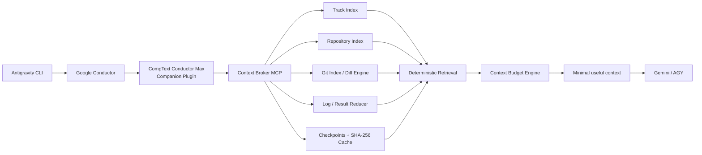
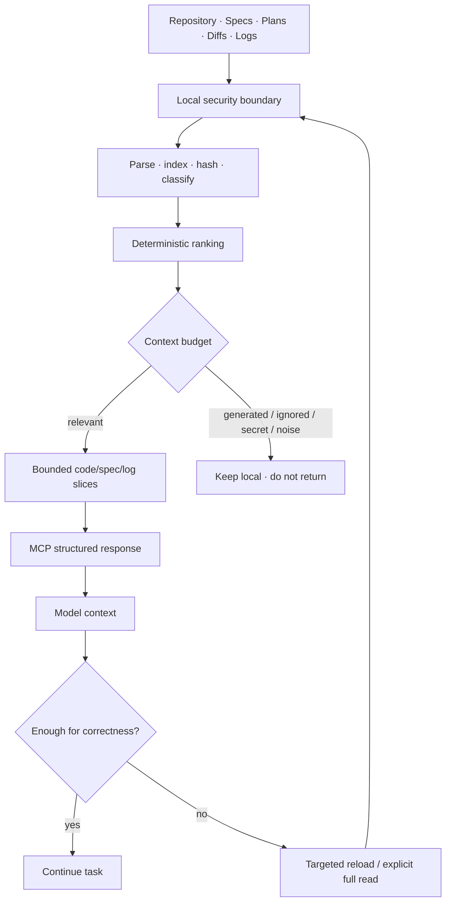
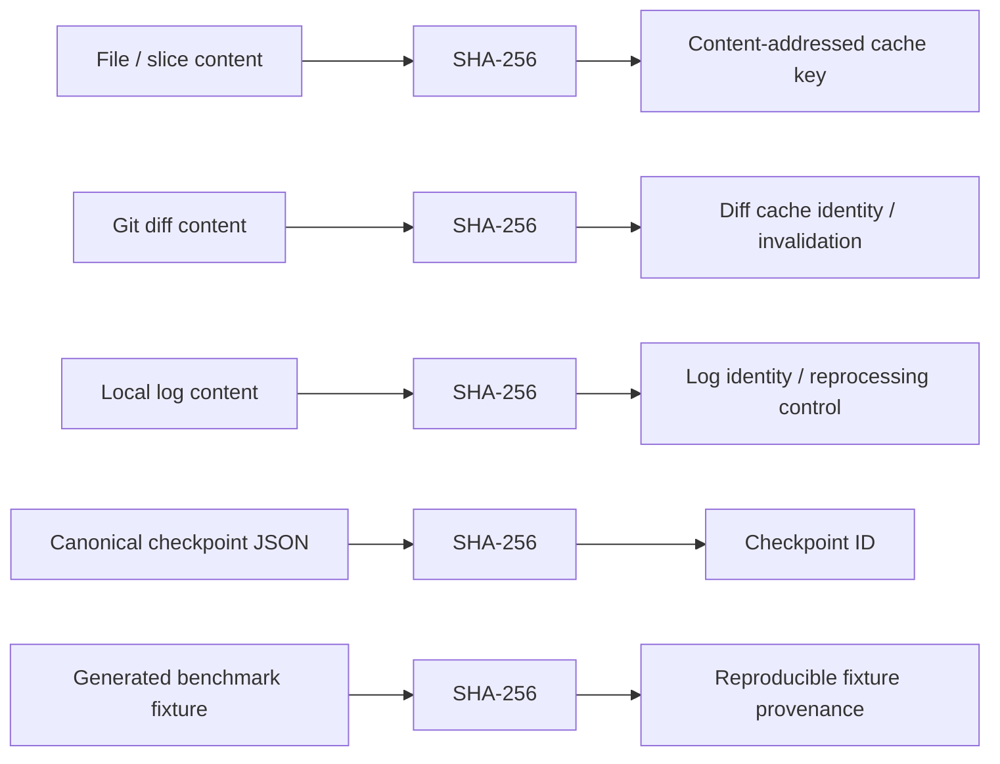
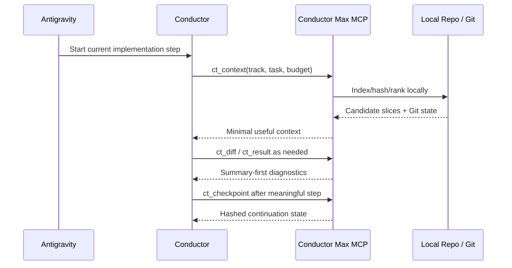
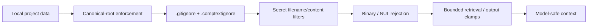

<h1 align="center">CompText Conductor Max</h1>

<p align="center">
  <strong>Local-first Context Broker MCP companion for Google Conductor and Antigravity CLI.</strong><br/>
  <em>Compute before context.</em>
</p>

<p align="center">
  
  
  
  
  
  
  
  
  
  
</p>

> **Status:** production-oriented first version on `feature/context-broker-mcp`. The evidence badges above describe the verified feature-branch snapshot; benchmark values are reproducible fixture results, not universal savings guarantees.

## Problem

Large agentic coding sessions waste model context on whole repositories, repeated specifications, complete diffs, generated files, and thousands of build-log lines. Prompt shortening alone does not solve this because once raw tool output reaches the model, the context cost has already been paid.

CompText Conductor Max moves deterministic work outside the LLM context: safe indexing, ranking, slice selection, Git-diff classification, log reduction, checkpointing, content-addressed caching, and accounting. The MCP returns only the information selected for the current task.

## Architecture



Conductor is not forked. Its track files are detected and read without modification. The broker is local-first and the default MCP transport is stdio.

See [`docs/architecture.md`](docs/architecture.md) for component boundaries and data flow.

## Compute before context



The primary gain comes from **selection and local computation**, not compact prose:

- repository files are indexed into bounded slices instead of returned wholesale;
- deterministic lexical, symbol, Git, and Conductor signals rank candidate slices;
- `ct_diff` returns a summary and stable hunk IDs before hunk text;
- `ct_result` extracts failures, diagnostics, test counts, and likely files from large logs;
- checkpoints replace repeated chat-history replay for agent handoffs;
- SHA-256 keyed cache entries avoid reprocessing unchanged content;
- generated files, binaries, ignored paths, and likely secrets are excluded by default;
- hard context budgets apply after ranking and report critical omissions instead of silently guessing.

If bounded retrieval is insufficient for correctness, the rules explicitly permit targeted or full reads of the required file or range.

## Benchmark snapshot

The committed benchmark is **synthetic and reproducible**. Seed `20260807` generated fixture SHA-256:

```text
60e3a95992e3dd4786f8e858991bf8ca3cedff8831ae05ca93c42b2937c38421
```

| Metric | Naive full-context | Conductor Max BALANCED | Delta |
| --- | ---: | ---: | ---: |
| Raw / returned bytes | 986,077 | 13,910 | **-98.59% by delivered token estimate** |
| `estimated_tokens` | 246,520 | 3,478 | **-243,042** |
| Required benchmark facts missing | 0 / 10 | 0 / 10 | **no loss in fixture** |

<p align="center">
  
</p>

SAFE and MAX produced the same returned size in this fixture because every task-relevant fact fit below the smallest profile ceiling. This does **not** mean the profiles are equivalent on larger relevant working sets.

Run the benchmark yourself:

```bash
ct-conductor benchmark --output benchmarks/results/latest.json --seed 20260807
```

The benchmark gate requires BALANCED or MAX to reduce delivered context by at least 50% while retaining every manifest-required fact. Exact measurements are committed in [`benchmarks/results/latest.json`](benchmarks/results/latest.json).

## Context budget profiles

<p align="center">
  
</p>

### Profile matrix

| Behavior | SAFE | BALANCED | MAX |
| --- | --- | --- | --- |
| Hard ceiling | **30,000** | **18,000** | **10,000** |
| Current task / plan step | Critical | Critical | Critical |
| Relevant spec sections | Broader | Targeted | Minimal sufficient set |
| Changed code | High priority | High priority | Delta-first |
| Adjacent code | More permissive | Selective | Minimal |
| Historical context | Low priority | Very low priority | Checkpoint-first |
| Diff handling | Summary → hunk | Summary → hunk | Summary → smallest needed hunk |
| Build/test logs | Reduced locally | Reduced locally | Local-file reduction preferred |
| Generated content | Omitted by default | Omitted by default | Omitted by default |
| Full-file fallback | Allowed when useful | Targeted | Only when correctness requires it |
| Checkpoint handoff | Preferred | Strongly preferred | Default continuation path |
| Correctness fallback | **Always allowed** | **Always allowed** | **Always allowed** |

A caller may request a smaller budget. A larger call-time value never raises the selected profile's hard ceiling. Token values are labelled `estimated_tokens` unless a model-specific exact tokenizer is available.

## MCP tool matrix

Exactly six primary tools are exposed to keep MCP schema overhead bounded.

| Tool | Local computation | Model-facing result | Primary token-saving mechanism |
| --- | --- | --- | --- |
| `ct_context` | Track/spec/plan/source/Git assembly + scoring | Bounded task context | Relevance selection |
| `ct_search` | Safe index search + ranking | Top-K slices | Partial reads instead of full files |
| `ct_diff` | Git parsing + classification | Summary or one bounded hunk | Summary-first / delta-first |
| `ct_result` | Build/test/lint/security-log parsing | Failures + diagnostics + likely files | Noise removal before context |
| `ct_checkpoint` | Canonical state serialization + SHA-256 | Versioned continuation state | Checkpoint instead of history replay |
| `ct_stats` | Local accounting | Reduction/cache/read metrics | Measured evidence, not a heuristic claim |

Index, cache, benchmark, and doctor operations remain CLI concerns rather than expanding the permanent MCP schema.

## Cryptographic integrity & provenance

CompText Conductor Max uses **SHA-256 content hashing** for deterministic identity, cache invalidation, checkpoint identity, and benchmark reproducibility.



| Object | Cryptographic primitive | Purpose |
| --- | --- | --- |
| Repository content | SHA-256 | Detect content changes and safely reuse cached analysis |
| Diff state | SHA-256 | Stable identity for unchanged diff inputs |
| Logs | SHA-256 | Detect repeated/changed local result inputs |
| Checkpoint canonical JSON | SHA-256 | Deterministic, reproducible checkpoint identity |
| Benchmark fixture | SHA-256 | Prove that reported measurements refer to the same generated fixture |

> **Security boundary:** SHA-256 here provides collision-resistant content identity and integrity/change detection. v0.1 does **not** claim digital signatures, author authenticity, encryption, HMAC authentication, or a PKI trust chain. Those would require explicit keys and a separate signed-provenance design.

This distinction is deliberate: cryptographic hashes make the local processing pipeline reproducible and stale-cache resistant without pretending that a hash alone proves who created an artifact.

## Conductor integration

Preferred track layout:

```text
conductor/
  tracks/
    <track>/
      spec.md
      plan.md
      metadata.json
```

The broker detects this structure, extracts the first unchecked plan item as the current step, and uses relevant specification/plan slices as high-priority context. A conservative fallback looks for equivalent `spec.md` / `plan.md` pairs beneath `conductor/`. Conductor files remain read-only.



Example:

```bash
ct-conductor context --root . --track demo --task "implement current plan step" --profile balanced
```

## Antigravity setup

The companion bundle follows the Antigravity plugin shape validated during the `2026-08-07` research pass:

```text
plugin.json
mcp_config.json
rules/comptext-conductor-max.md
skills/conductor-max/SKILL.md
```

`mcp_config.json` registers a local stdio server named `comptext-conductor-max` and starts `ct-conductor-mcp`. The server uses the process working directory as project root unless `CT_CONDUCTOR_ROOT` is set. If the host launches MCP servers outside the active workspace, set that environment variable or configure an appropriate `cwd`.

No permanent hook is required in v0.1; avoiding one keeps standing instruction overhead small.

## Installation

Requires Python 3.12+ and Git.

```bash
python -m pip install .
ct-conductor doctor --root /path/to/project
```

For development:

```bash
python -m pip install -e '.[dev]'
```

The installation exposes `ct-conductor` and `ct-conductor-mcp` on `PATH`.

## Security

Default behavior is local-only. The broker:

- resolves paths against a canonical project root and blocks traversal/escapes;
- skips symlinks while indexing and rejects external symlink reads;
- respects `.gitignore` and `.comptextignore`;
- excludes common secret filenames and directories;
- rejects binary/NUL-containing data before decoding;
- applies conservative secret-content patterns before returning text;
- invokes Git with argument vectors, `shell=False`, bounded output paths, and timeouts;
- clamps untrusted MCP output-limit arguments;
- bounds diff-hunk output;
- can reduce large logs through a safe local `log_path`, keeping raw output outside the LLM context;
- has no telemetry path and no broker runtime network call.



Secret detection is defense in depth, not a replacement for a dedicated repository secret scanner. See [`docs/security.md`](docs/security.md) and [`docs/security-review.md`](docs/security-review.md).

### Verified security evidence

- Bandit: **0 High / 0 Medium**; low-severity findings reviewed and documented.
- Isolated runtime dependency audit: **no known vulnerabilities** in installed project dependencies at verification time.
- Regression coverage includes `.env` exclusion, traversal, external symlink handling, binary rejection, checkpoint path hardening, bounded MCP arguments, and bounded diff hunks.
- GitHub Code Scanning was not enabled for this private repository during the verification pass; an empty remote alert list is therefore **not** represented as a clean CodeQL result.

## Verification

Final feature-branch quality gate:

| Gate | Result |
| --- | --- |
| `pytest -q` | **44 passed** |
| `ruff check .` | **passed** |
| `mypy src` | **19 source files, no issues** |
| `python -m build` | **sdist + wheel built** |
| MCP in-memory SDK test | **passed** |
| MCP real stdio subprocess | **initialize + six tools + call passed** |
| Simulated Conductor workflow | **track files remained byte-for-byte unchanged by hash** |
| Synthetic benchmark | **98.59% reduction, 0/10 facts missing** |
| Bandit | **0 High / 0 Medium** |

The full review trail is in [`docs/code-review.md`](docs/code-review.md) and [`docs/security-review.md`](docs/security-review.md).

## Troubleshooting

**`ct_diff` reports unavailable:** confirm the project is a Git worktree and `git` is on `PATH`. Other retrieval remains usable without Git.

**`budget_exceeded` / `omitted_critical`:** increase the budget within the profile ceiling or fetch the named target explicitly. Do not infer the missing fact.

**Large command output:** redirect it to a local project log, for example:

```bash
pytest -q > test-output.log 2>&1
```

Then use `ct_result(log_path="test-output.log")`. The raw log never needs to be streamed into the model first.

**MCP starts in the wrong directory:** set `CT_CONDUCTOR_ROOT` to the active project root or configure MCP `cwd` for that workspace.

**A file is missing from search:** check `.gitignore`, `.comptextignore`, secret/binary classification, and generated-content detection. Use normal reads only after confirming the omission is intentional and safe.

## Development

Primary checks:

```bash
pytest -q
ruff check .
mypy src
python -m build
ct-conductor benchmark --output benchmarks/results/latest.json --seed 20260807
```

The implementation plan and design record are under [`docs/superpowers/`](docs/superpowers/); final review evidence is in [`docs/code-review.md`](docs/code-review.md) and [`docs/security-review.md`](docs/security-review.md). The quality standard is evidence before success claims: tests, static checks, MCP smoke tests, integration fixtures, security review, and a fresh benchmark must run on the final implementation state.

## License

CompText Conductor Max is released under the MIT License. External projects listed in [`docs/research.md`](docs/research.md) were used as documentation/architecture references only; their licenses remain their own.
