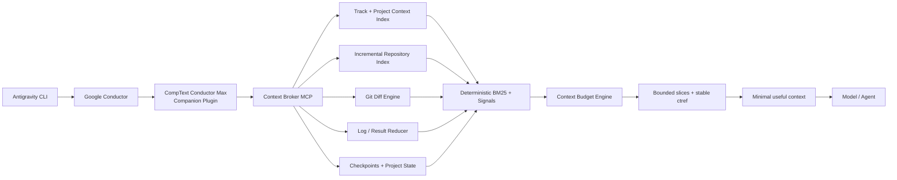
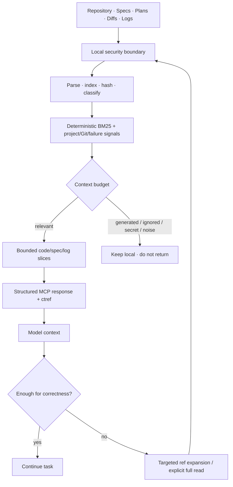
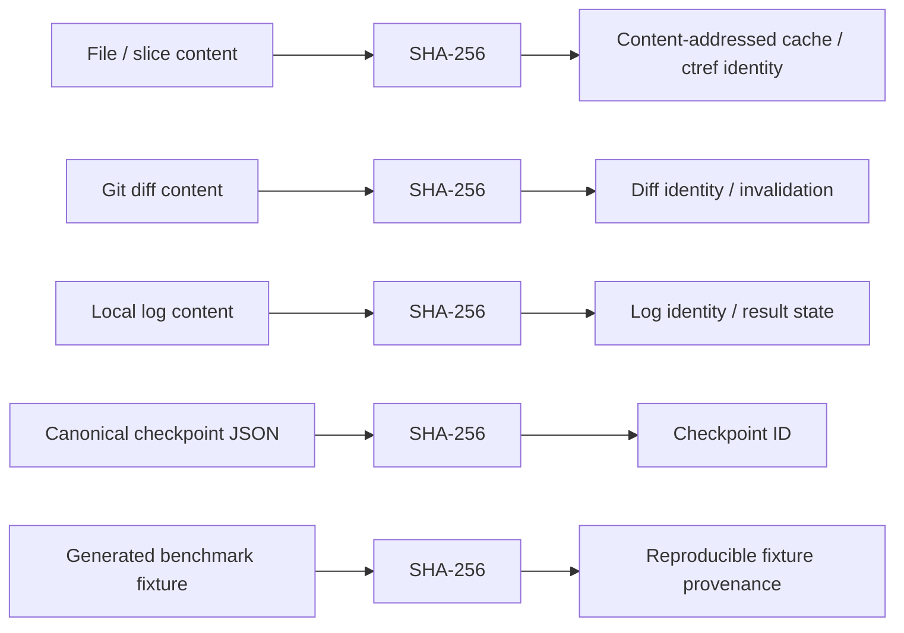
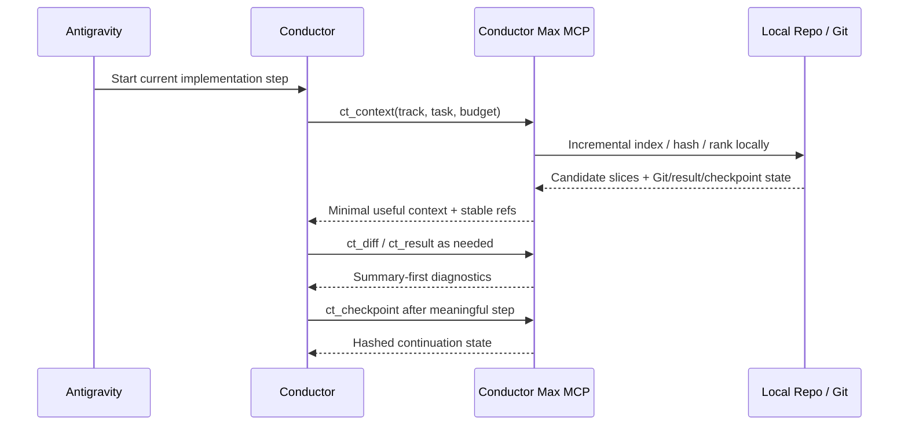
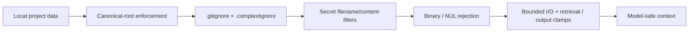

<p align="center">
  
</p>

<p align="center">
  
  
  
  
  
  
  
  
  
  
</p>

<p align="center">
  <strong>Local-first Context Broker MCP companion for Google Conductor and Antigravity CLI.</strong><br/>
  Deterministic retrieval, bounded context, summary-first diffs/logs, checkpoints, and measurable context reduction.
</p>

<p align="center">
  <a href="#architecture">Architecture</a> ·
  <a href="#benchmark-snapshot">Benchmark</a> ·
  <a href="#context-budget-profiles">Profiles</a> ·
  <a href="#mcp-tool-matrix">MCP tools</a> ·
  <a href="#cryptographic-integrity--provenance">Integrity</a> ·
  <a href="#security">Security</a> ·
  <a href="#installation">Install</a>
</p>

> **Status:** v0.2 production-oriented feature branch on `feature/context-broker-mcp`. Evidence below describes the verified branch/CI snapshot. Benchmark values are reproducible synthetic fixture measurements, not universal savings guarantees. Real Antigravity host-token savings require an A/B workload and are not claimed here.

## Problem

Large agentic coding sessions waste model context on whole repositories, repeated specifications, complete diffs, generated files, and thousands of build-log lines. Prompt shortening alone does not solve this because once raw tool output reaches the model, the context cost has already been paid.

**CompText Conductor Max moves deterministic work outside the LLM context.** It performs safe indexing, ranking, slice selection, Git-diff classification, log reduction, checkpointing, content-addressed caching, and accounting locally, then returns only the information selected for the current task.

## Architecture



Conductor is **not forked**. Its project/track files are detected and read without modification. The broker is local-first and the default MCP transport is stdio.

See [`docs/architecture.md`](docs/architecture.md) and [`docs/v0.2-runtime.md`](docs/v0.2-runtime.md) for component boundaries, upstream compatibility, and the v0.2 hardening record.

### Compute before context



The gain comes from **selection and local computation**, not compact prose:

- repository files are indexed into bounded slices instead of returned wholesale;
- deterministic BM25-style lexical scoring is combined with symbol, Git, Conductor, failure, and preferred-context signals;
- unchanged files can reuse warm stat-keyed index entries without reopening and rehashing file content;
- `ct_diff` returns a summary and stable hunk IDs before hunk text;
- `ct_result` extracts failures, diagnostics, test counts, and likely files from large logs and feeds likely files into the next context ranking;
- checkpoints persist the latest meaningful track state and feed the next agent step instead of replaying full chat history;
- `ct_search` results carry content-addressed `ctref:v1:*` references that can be expanded with the same tool; stale refs never drift to changed content;
- generated files, binaries, ignored paths, and likely secrets are excluded by default;
- hard budgets report critical omissions instead of silently guessing.

If bounded retrieval is insufficient for correctness, the rules explicitly permit a targeted or full read of the required file or range.

## Benchmark snapshot

The committed benchmark is **synthetic and reproducible**. Seed `20260807` generated fixture SHA-256:

```text
60e3a95992e3dd4786f8e858991bf8ca3cedff8831ae05ca93c42b2937c38421
```

The v0.2 values below were executed in GitHub Actions CI, not copied from the v0.1 report.

| Metric | Naive full-context | Conductor Max BALANCED | Delta |
| --- | ---: | ---: | ---: |
| Raw / returned bytes | 986,077 | 13,902 | — |
| `estimated_tokens` | 246,520 | 3,476 | **-243,044** |
| Measured token reduction | — | **98.59%** | — |
| Required fixture facts missing | 0 / 10 | 0 / 10 | **no loss in fixture** |

<p align="center">
  
</p>

SAFE, BALANCED, and MAX returned the same amount in this fixture because every task-relevant fact fit below the smallest profile ceiling. This does **not** mean the profiles are equivalent on larger relevant working sets.

Run it yourself:

```bash
ct-conductor benchmark --output benchmarks/results/latest.json --seed 20260807
```

The benchmark gate requires BALANCED or MAX to reduce delivered context by at least 50% while retaining every manifest-required fact. Exact measurements are committed in [`benchmarks/results/latest.json`](benchmarks/results/latest.json) and explained in [`docs/benchmark.md`](docs/benchmark.md).

## Context budget profiles

<p align="center">
  
</p>

### Profile matrix

| Behavior | SAFE | BALANCED | MAX |
| --- | --- | --- | --- |
| Hard ceiling | **30,000** | **18,000** | **10,000** |
| Current task / plan step | Critical | Critical | Critical |
| Relevant spec sections | Broader | Targeted | Minimal sufficient set |
| Project context | Preferred | Selective | Minimal relevant set |
| Changed code | High priority | High priority | Delta-first |
| Failure files | High priority | High priority | High priority |
| Historical context | Low priority | Very low priority | Checkpoint-first |
| Diff handling | Summary → hunk | Summary → hunk | Summary → smallest needed hunk |
| Build/test logs | Reduced locally | Reduced locally | Local-file reduction preferred |
| Generated content | Omitted by default | Omitted by default | Omitted by default |
| Full-file fallback | Allowed when useful | Targeted | Only when correctness requires it |
| Checkpoint handoff | Preferred | Strongly preferred | Default continuation path |
| Correctness fallback | **Always allowed** | **Always allowed** | **Always allowed** |

A caller may request a smaller budget. A larger call-time value never raises the selected profile's hard ceiling. Token values are labelled `estimated_tokens` unless a model-specific exact tokenizer is available.

## MCP tool matrix

Exactly six primary tools are exposed to keep permanent MCP schema overhead bounded.

| Tool | Local computation | Model-facing result | Primary reduction mechanism |
| --- | --- | --- | --- |
| `ct_context` | Track/project/source/Git/result/checkpoint assembly + scoring | Bounded task context | Relevance selection |
| `ct_search` | Safe index search + BM25 ranking or `ctref` expansion | Top-K bounded slices | Partial reads + reversible expansion |
| `ct_diff` | Git parsing + classification | Summary or one bounded hunk | Summary-first / delta-first |
| `ct_result` | Build/test/lint/security-log parsing | Failures + diagnostics + likely files | Noise removal before context |
| `ct_checkpoint` | Canonical state serialization + SHA-256 | Versioned continuation state | Checkpoint instead of history replay |
| `ct_stats` | Local accounting | Reduction/cache/read metrics | Measured evidence |

Index, cache, benchmark, doctor, and Antigravity host-probe operations remain CLI concerns rather than expanding the permanent MCP schema.

## Cryptographic integrity & provenance

CompText Conductor Max uses **SHA-256 content hashing** for deterministic identity, cache invalidation, checkpoint identity, context-reference identity, and benchmark reproducibility.



| Object | Primitive | Purpose |
| --- | --- | --- |
| Repository content | SHA-256 | Detect content changes and safely reuse cached analysis |
| Context slice reference | SHA-256 | Bind a ref to path/range/content so changed content becomes stale |
| Diff state | SHA-256 | Stable identity for unchanged diff inputs |
| Logs | SHA-256 | Detect repeated or changed local result inputs |
| Checkpoint canonical JSON | SHA-256 | Deterministic, reproducible checkpoint identity |
| Benchmark fixture | SHA-256 | Bind reported measurements to the generated fixture |

> **Security boundary:** SHA-256 here provides collision-resistant content identity and integrity/change detection. v0.2 does **not** claim digital signatures, author authenticity, encryption, HMAC authentication, or a PKI trust chain. Those require explicit keys and a separate signed-provenance design.

This distinction is deliberate: cryptographic hashes make the local processing pipeline reproducible and stale-cache resistant without pretending that a hash alone proves who created an artifact.

## Conductor integration

Current preferred project/track layout:

```text
conductor/
  product.md
  product-guidelines.md
  tech-stack.md
  workflow.md
  tracks.md
  code_styleguides/
    *.md
  tracks/
    <track>/
      spec.md
      plan.md
      metadata.json   # optional
      index.md        # optional compatibility artifact
```

The broker extracts the first unchecked plan item as the current step. `spec.md` and `plan.md` are critical inputs; project context, metadata, and index artifacts are preferred/ranked instead of blindly injected. A conservative fallback still looks for equivalent `spec.md` / `plan.md` pairs beneath `conductor/`. Conductor files remain read-only.



Example:

```bash
ct-conductor context --root . --track demo --task "implement current plan step" --profile balanced
```

## Installation

Requires Python 3.12+ and Git.

```bash
python -m pip install .
ct-conductor doctor --root /path/to/project
```

For development:

```bash
python -m pip install -e '.[dev]'
```

The installation exposes `ct-conductor` and `ct-conductor-mcp` on `PATH`.

### Antigravity setup

The v0.2 companion bundle follows the current Antigravity plugin shape:

```text
plugin.json
mcp_config.json
rules/comptext-conductor-max.md
skills/conductor-max/SKILL.md
agents/context-researcher/agent.md
```

`plugin.json` declares the official `https://antigravity.google/schemas/v1/plugin.json` schema. `mcp_config.json` registers a local stdio server named `comptext-conductor-max` and starts `ct-conductor-mcp`.

The `context-researcher` is a sandboxed Flash subagent intended to keep repository exploration, diff inspection, and log reduction out of the main agent's working context. It deliberately has no static `tools:` allowlist, avoiding breakage from host-specific or invalid tool identifiers.

The server uses the process working directory as project root unless `CT_CONDUCTOR_ROOT` is set. If the host launches MCP servers outside the active workspace, set that variable or configure an appropriate `cwd`.

No permanent hook is required in v0.2; avoiding one keeps standing instruction overhead small. Hooks remain a future option only where measurement shows a clear benefit.

For host usage support:

```bash
ct-conductor agy-probe --root /path/to/project
```

When `agy` is installed and authenticated, the probe parses the terminal Antigravity `stream-json` `result.usage` object (`input_tokens`, `output_tokens`, `thinking_tokens`, `cache_read_tokens`, `total_tokens`). The probe validates integration; it is **not** an A/B savings benchmark.

## Security

Default behavior is local-only. The broker:

- resolves paths against a canonical project root and blocks traversal/escapes;
- uses bounded file reads instead of reading an entire large file before truncation;
- skips symlinks while indexing and rejects external symlink reads;
- respects `.gitignore` and `.comptextignore`;
- excludes common secret filenames and directories;
- rejects binary/NUL-containing data before decoding;
- applies conservative secret-content patterns before returning text;
- invokes Git and Antigravity probes with argument vectors rather than shell command construction;
- clamps untrusted MCP output-limit arguments;
- bounds diff-hunk and ref-expansion output;
- makes stale context refs fail closed instead of drifting to changed content;
- can reduce large logs through a safe local `log_path`, keeping raw output outside the LLM context;
- has no telemetry path and no broker runtime network call.



Secret detection is defense in depth, not a replacement for a dedicated repository secret scanner. See [`docs/security.md`](docs/security.md) and [`docs/security-review.md`](docs/security-review.md).

### Verified security evidence

- GitHub Actions Bandit medium/high gate: **passed** on the v0.2 CI candidate.
- `pip-audit --skip-editable`: **No known vulnerabilities found** for installed dependencies on the v0.2 CI candidate; the editable local package itself is correctly skipped.
- Regression coverage includes `.env` exclusion, traversal, external symlink handling, binary rejection, bounded file I/O, checkpoint path hardening, bounded MCP arguments, bounded diff hunks, and stale-ref behavior.
- GitHub Code Scanning is not represented as a clean CodeQL result unless a real configured scan runs.
- The connected GitHub API currently reports this repository as **public**, which conflicts with the original private-repository requirement. This remains an explicit repository-configuration P0 until visibility is changed through a supported settings surface.

## Verification

The v0.2 remote quality gate runs on Ubuntu 24.04 / Python 3.12 and includes:

| Gate | Verified evidence |
| --- | --- |
| `pytest -q` | **57 passed** on CI Run #72 before the added real-stdio regression test; current PR checks are authoritative for the latest head |
| `ruff check .` | **passed** |
| `mypy src` | **22 source files, no issues** |
| `python -m build` | **0.2.0 sdist + wheel built** |
| MCP in-memory SDK tests | **passed** |
| MCP real stdio subprocess | Regression test included on the latest head; verify via current PR CI before merge |
| Synthetic benchmark | **246,520 → 3,476 `estimated_tokens`; 98.59%; 0/10 facts missing** |
| Bandit medium/high gate | **passed** |
| Dependency audit | **No known vulnerabilities found** |
| Antigravity host usage parser | Official terminal `result.usage` fields covered by tests; real A/B savings not yet claimed |

The complete v0.2 upstream/hardening record is in [`docs/v0.2-runtime.md`](docs/v0.2-runtime.md). The earlier review trail remains in [`docs/code-review.md`](docs/code-review.md) and [`docs/security-review.md`](docs/security-review.md).

## Troubleshooting

**`ct_diff` reports unavailable:** confirm the project is a Git worktree and `git` is on `PATH`. Other retrieval remains usable without Git.

**`budget_exceeded` / `omitted_critical`:** increase the budget within the profile ceiling or fetch the named target explicitly. Do not infer the missing fact.

**A `ctref` is stale:** rerun `ct_search(query=...)`. Refs intentionally bind to the content hash and do not silently follow changed files.

**Large command output:** redirect it to a local project log, for example:

```bash
pytest -q > test-output.log 2>&1
```

Then use `ct_result(log_path="test-output.log")`. The raw log never needs to be streamed into the model first.

**MCP starts in the wrong directory:** set `CT_CONDUCTOR_ROOT` to the active project root or configure MCP `cwd` for that workspace.

**A file is missing from search:** check `.gitignore`, `.comptextignore`, secret/binary classification, and generated-content detection. Use normal reads only after confirming the omission is intentional and safe.

**`agy-probe` reports unavailable:** ensure the Antigravity CLI is installed, on `PATH`, and authenticated. Do not substitute synthetic benchmark values for missing host usage.

## Development

Primary checks:

```bash
pytest -q
ruff check .
mypy src
python -m build
ct-conductor benchmark --output benchmarks/results/latest.json --seed 20260807
```

CI additionally runs Bandit and `pip-audit`. The implementation plan and design record are under [`docs/superpowers/`](docs/superpowers/); v0.2 upstream/hardening evidence is in [`docs/v0.2-runtime.md`](docs/v0.2-runtime.md).

## License

CompText Conductor Max is released under the MIT License. External projects listed in [`docs/research.md`](docs/research.md) were used as documentation/architecture references only; their licenses remain their own.

<p align="center">
  
</p>